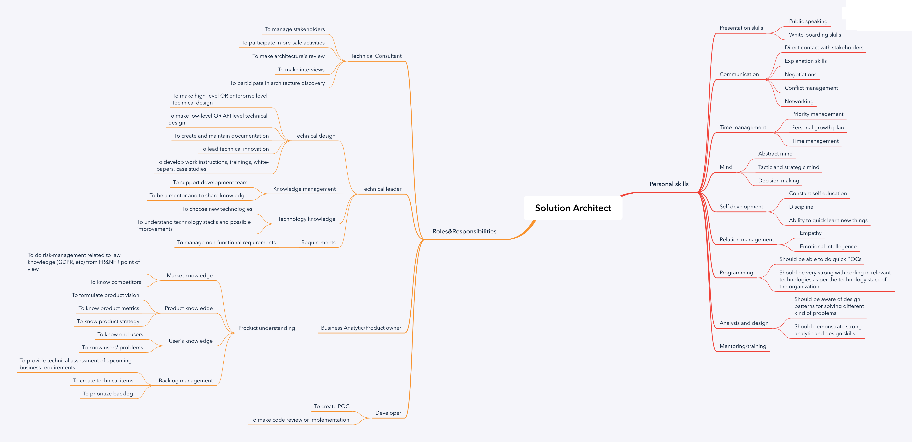

# Solution Architect Road Map

This is a Skills map and roles&responsibilities of Solution Architects created by Nikolai Ashanin.

# Road Map

It includes two main parts:
- **Roles&Responsibilities.** High level list of working roles and concrete responsibilities.
- **Personal skills.** Personal skills that are required for playing those roles.

## Download Road Map

- [PNG](Solution_Architect.png)
- [Mindmap](Solution_Architect.xmind)

# Work in progress

Current version in pre-alpha. You are really welcome to contribute to a project via pull request or you can create an issue.

# Acknowledgments

Inspired by https://github.com/tlbootcamp/tlroadmap.
