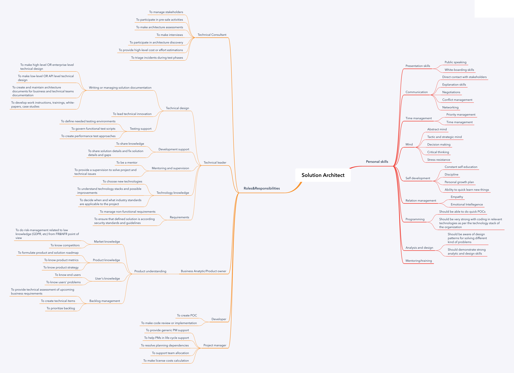

# Solution Architect Road Map

This is a Skills map and roles&responsibilities of Solution Architects created by [Nikolai Ashanin](https://www.linkedin.com/in/nikolay-ashanin-7bb3a57a/).

Solution Architect position becomes more and more popular nowadays. If 10 years ago, there were almost no such roles in IT companies then today those specialists can be seen in a lot of projects.

However, there are just a few sources and books which can help with Solution Architecture definition, Roles&Responsibilities and required skills.

The goal of this Road Map is to help in understanding what is Solution Architect role about and how to grow in that direction. To achieve this there is a plan to interview people who already plays Solution Architect role in different companies.

# Road Map

It includes two main parts:
- **Roles&Responsibilities.** High level list of working roles and concrete responsibilities.
- **Personal skills.** Personal skills that are required for playing those roles.

## Download Road Map

- [PNG](Architect.png)
- [Mindmap](Architect.xmind)

# Work in progress

Current version in pre-alpha. You are really welcome to contribute to a project via pull request or you can create an issue.

# How to contribute

Please, feel free to contribute to this Road Map.
In case, if you are a Solution Architect OR playing a simular role then there are a few possibities how to contribute:
- Create a pull request with improvements.
- Create an issue with your concerns.
- Feel free to contact me directly to discuss raised questions.

# Knowledge Base

## The structure

Each point will be described in a proper way:
- Definition
- Why is it important
- How to improve
- Sources/books/courses

## Roles&Responsibilities

- Technical Consultant
  - To manage stakeholders
  - To participate in pre-sale activities
  - To make architecture assessments
  - To make interviews
  - To participate in architecture discovery
  - To provide high-level cost or effort estimations
  - To triage incidents during test phases
- Technical leader
  - Technical design
    - Writing or managing solution documentation
	- To make high-level OR enterprise level technical design
	- To make low-level OR API level technical design
	- To create and maintain architecture documents for business and technical teams documentation
	- To develop work instructions, trainings, white-papers, case studies
    - To lead technical innovation
    - Testing support
      - To define needed testing environments
      - To govern functional test scripts
      - To create performance test approaches
  - Development support
    - To share knowledge
    - To share solution details and fix solution details and gaps
  - Mentoring and supervision
    - To be a mentor
    - To provide a supervision to solve project's and technical issues
  - Technology knowledge
    - To choose new technologies
    - To understand technology stacks and possible improvements
    - To decide when and what industry standards are applicable to the project
  - Requirements
    - To manage non-functional requirements
    - To ensure that defined solution is according security standards and guidelines
- Business Anatytic/Product owner
  - Product understanding
    - Market knowledge
      - To do risk-management related to law knowledge (GDPR, etc) from FR&NFR point of view
      - To know competitors
    - Product knowledge
      - To formulate product and solution roadmap
      - To know product metrics
      - To know product strategy
    - User's knowledge
      - To know end users
      - To know users' problems
    - Backlog management
      - To provide technical assessment of upcoming business requirements
      - To create technical items
      - To prioritize backlog
- Developer
  - To create POC
  - To make code review or implementation
- Project manager
  - To provide generic PM support
  - To help PMs in life-cycle support
  - To resolve planning dependencies
  - To support team allocation
  - To make license costs calculation

## Personal skills
- Presentation skills
  - Public speaking
  - White-boarding skills
- Communication
  - Direct contact with stakeholders
  - Explanation skills
  - Negotiations
  - Conflict management
  - Networking
- Time management
  - Priority management
  - Time management
- Mind
  - Abstract mind
  - Tactic and strategic mind
  - Decision making
  - Stress resistance
- Self development
  - Constant self education
  - Discipline
  - Personal growth plan
  - Ability to quick learn new things
- Relation management
  - Empathy
  - Emotional Intellegence
- Programming
  - Should be able to do quick POCs
  - Should be very strong with coding in relevant technologies as per the technology stack of the organization
- Analysis and design
  - Should be aware of design patterns for solving different kind of problems
  - Should demonstrate strong analytic and design skills
- Mentoring/training

# Contacts

- https://medium.com/@nvashanin Blog about Solution Architecture
- https://www.linkedin.com/in/nikolay-ashanin-7bb3a57a/ For any questions feel free to contact OR nv.ashanin@gmail.com

# Acknowledgments

Inspired by https://github.com/tlbootcamp/tlroadmap.

Many thanks for providing feedback and supervision:
- [Frank Groot](https://www.linkedin.com/in/frank-groot-517624/) Solution Architect, Epam Systems/Liberty Global

